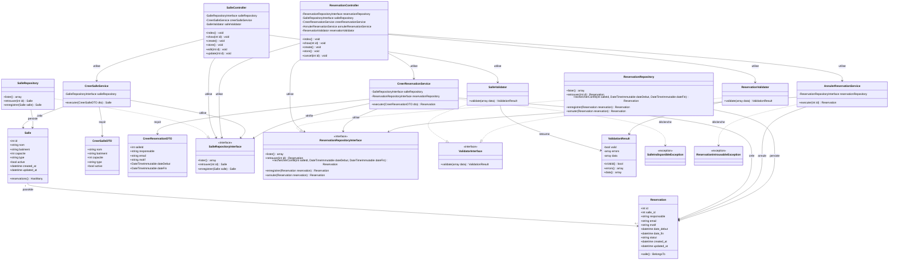

```mermaid
classDiagram

    %% =========================
    %% MODELES
    %% =========================

    class Salle {
        +int id
        +string nom
        +string batiment
        +int capacite
        +string type
        +bool active
        +datetime created_at
        +datetime updated_at
        +reservations() HasMany
    }

    class Reservation {
        +int id
        +int salle_id
        +string responsable
        +string email
        +string motif
        +datetime date_debut
        +datetime date_fin
        +string statut
        +datetime created_at
        +datetime updated_at
        +salle() BelongsTo
    }

    Salle "1" --> "0..*" Reservation : possède


    %% =========================
    %% CONTROLLERS
    %% =========================

    class SalleController {
        -SalleRepositoryInterface salleRepository
        -CreerSalleService creerSalleService
        -SalleValidator salleValidator

        +index() void
        +show(int id) void
        +create() void
        +store() void
        +edit(int id) void
        +update(int id) void
    }

    class ReservationController {
        -ReservationRepositoryInterface reservationRepository
        -SalleRepositoryInterface salleRepository
        -CreerReservationService creerReservationService
        -AnnulerReservationService annulerReservationService
        -ReservationValidator reservationValidator

        +index() void
        +show(int id) void
        +create() void
        +store() void
        +cancel(int id) void
    }


    %% =========================
    %% SERVICES
    %% =========================

    class CreerSalleService {
        -SalleRepositoryInterface salleRepository

        +executer(CreerSalleDTO dto) Salle
    }

    class CreerReservationService {
        -SalleRepositoryInterface salleRepository
        -ReservationRepositoryInterface reservationRepository

        +executer(CreerReservationDTO dto) Reservation
    }

    class AnnulerReservationService {
        -ReservationRepositoryInterface reservationRepository

        +executer(int id) Reservation
    }


    %% =========================
    %% DTO
    %% =========================

    class CreerSalleDTO {
        +string nom
        +string batiment
        +int capacite
        +string type
        +bool active
    }

    class CreerReservationDTO {
        +int salleId
        +string responsable
        +string email
        +string motif
        +DateTimeImmutable dateDebut
        +DateTimeImmutable dateFin
    }


    %% =========================
    %% REPOSITORIES
    %% =========================

    class SalleRepositoryInterface {
        <<interface>>

        +lister() array
        +retrouver(int id) Salle
        +enregistrer(Salle salle) Salle
    }

    class SalleRepository {
        +lister() array
        +retrouver(int id) Salle
        +enregistrer(Salle salle) Salle
    }

    class ReservationRepositoryInterface {
        <<interface>>

        +lister() array
        +retrouver(int id) Reservation
        +rechercherConflit(int salleId, DateTimeImmutable dateDebut, DateTimeImmutable dateFin) Reservation
        +enregistrer(Reservation reservation) Reservation
        +annuler(Reservation reservation) Reservation
    }

    class ReservationRepository {
        +lister() array
        +retrouver(int id) Reservation
        +rechercherConflit(int salleId, DateTimeImmutable dateDebut, DateTimeImmutable dateFin) Reservation
        +enregistrer(Reservation reservation) Reservation
        +annuler(Reservation reservation) Reservation
    }

    SalleRepository ..|> SalleRepositoryInterface
    ReservationRepository ..|> ReservationRepositoryInterface


    %% =========================
    %% VALIDATION
    %% =========================

    class ValidatorInterface {
        <<interface>>

        +validate(array data) ValidationResult
    }

    class SalleValidator {
        +validate(array data) ValidationResult
    }

    class ReservationValidator {
        +validate(array data) ValidationResult
    }

    class ValidationResult {
        -bool valid
        -array errors
        -array data

        +isValid() bool
        +errors() array
        +data() array
    }

    SalleValidator ..|> ValidatorInterface
    ReservationValidator ..|> ValidatorInterface

    SalleValidator --> ValidationResult : retourne
    ReservationValidator --> ValidationResult : retourne


    %% =========================
    %% EXCEPTIONS
    %% =========================

    class SalleIndisponibleException {
        <<exception>>
    }

    class ReservationIntrouvableException {
        <<exception>>
    }


    %% =========================
    %% RELATIONS CONTROLLERS
    %% =========================

    SalleController --> SalleRepositoryInterface : utilise
    SalleController --> CreerSalleService : utilise
    SalleController --> SalleValidator : utilise

    ReservationController --> ReservationRepositoryInterface : utilise
    ReservationController --> SalleRepositoryInterface : utilise
    ReservationController --> CreerReservationService : utilise
    ReservationController --> AnnulerReservationService : utilise
    ReservationController --> ReservationValidator : utilise


    %% =========================
    %% RELATIONS SERVICES
    %% =========================

    CreerSalleService --> SalleRepositoryInterface : utilise
    CreerSalleService --> CreerSalleDTO : reçoit
    CreerSalleService --> Salle : crée

    CreerReservationService --> SalleRepositoryInterface : vérifie
    CreerReservationService --> ReservationRepositoryInterface : utilise
    CreerReservationService --> CreerReservationDTO : reçoit
    CreerReservationService --> Reservation : crée
    CreerReservationService ..> SalleIndisponibleException : déclenche

    AnnulerReservationService --> ReservationRepositoryInterface : utilise
    AnnulerReservationService --> Reservation : annule
    AnnulerReservationService ..> ReservationIntrouvableException : déclenche


    %% =========================
    %% RELATIONS REPOSITORIES / MODELES
    %% =========================

    SalleRepository --> Salle : persiste
    ReservationRepository --> Reservation : persiste
```
